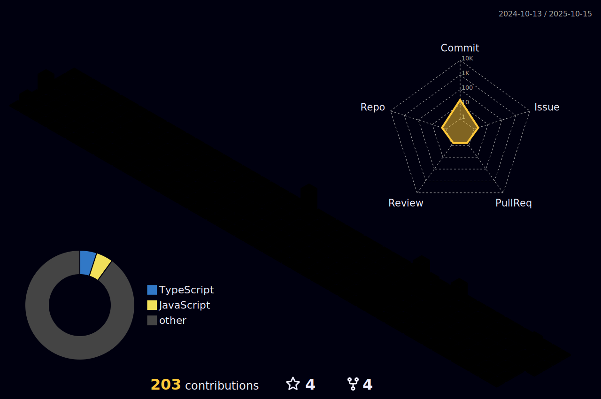

# Saudações! 🤖  Eu sou Joabe Conrado!

- 🧔 Sou um analista de desenvolvimento no Instituto de pesquisas Eldorado.
- 🌱 Estudante de engenharia de software.
##

 <h3>Minhas melhores formas de contato: </h3>

   

  ##

  
  

  
 |  |  |  
 | ----------- | ----------- |

  

 <h3>Minhas Stacks</h3>
  
 

   

  

  ##

